# 👗 Clothing Brand Website

A modern and responsive **Clothing Brand web application** built with **Next.js**, designed to showcase products, manage shopping cart functionality, and deliver a smooth e-commerce experience.

---

## 📸 Screenshots

<p align="center">
  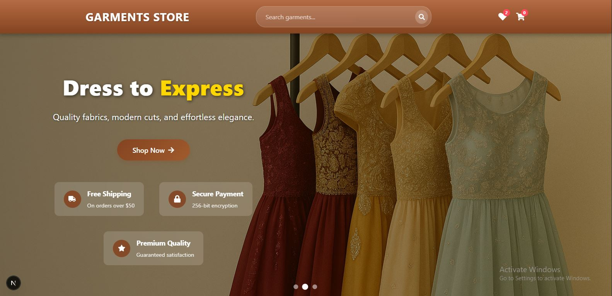
  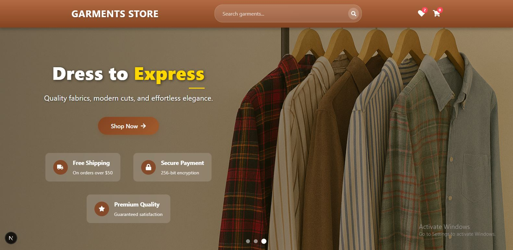
  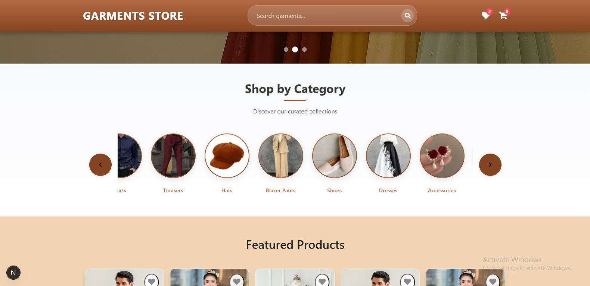
  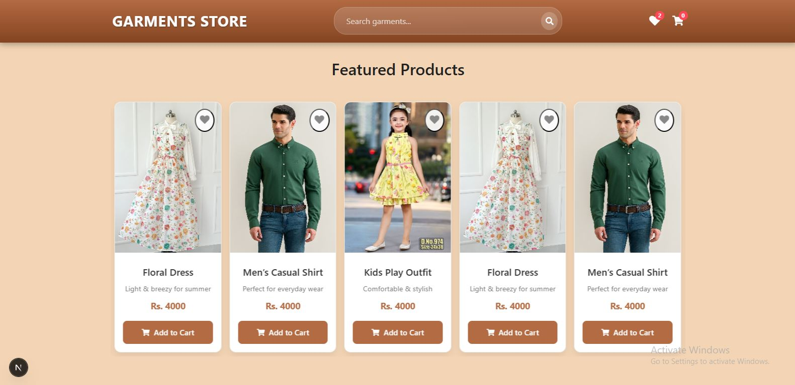
  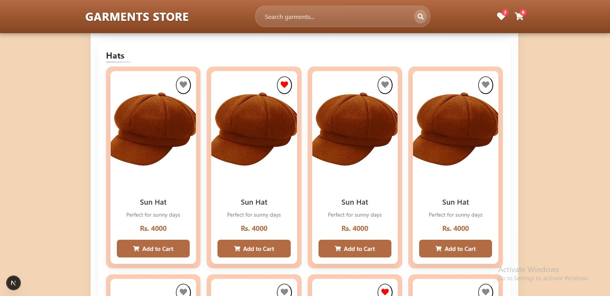
  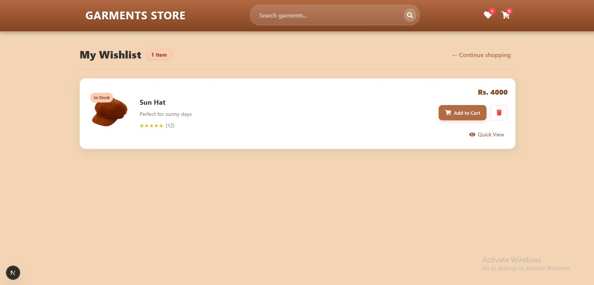
  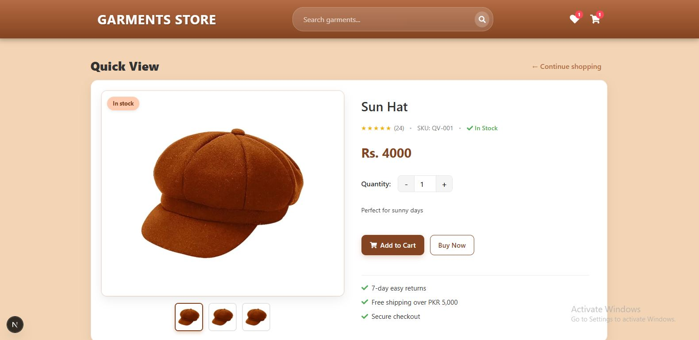
  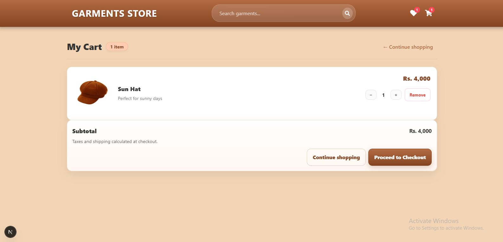
  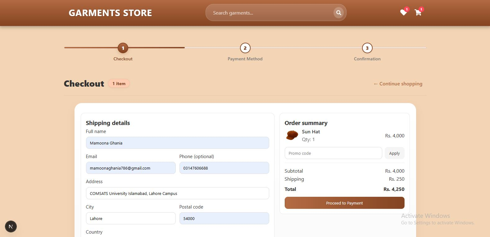
  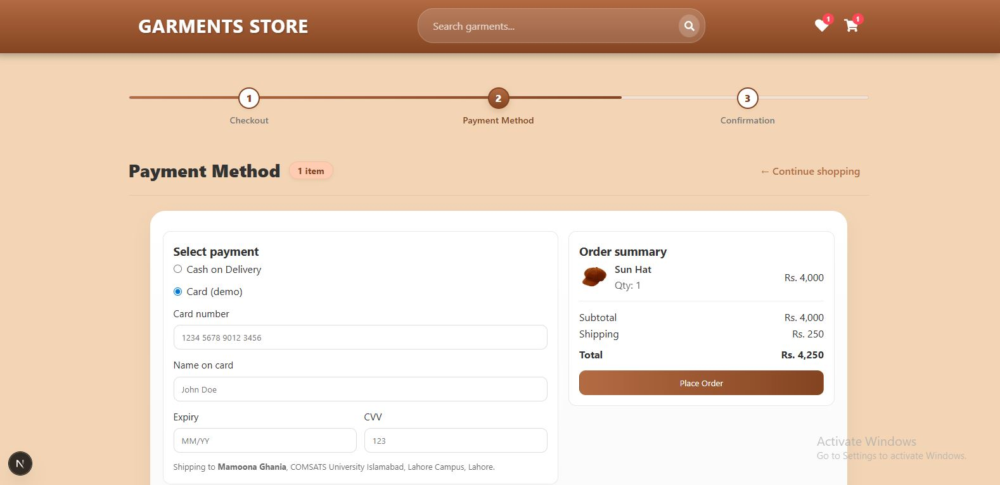
  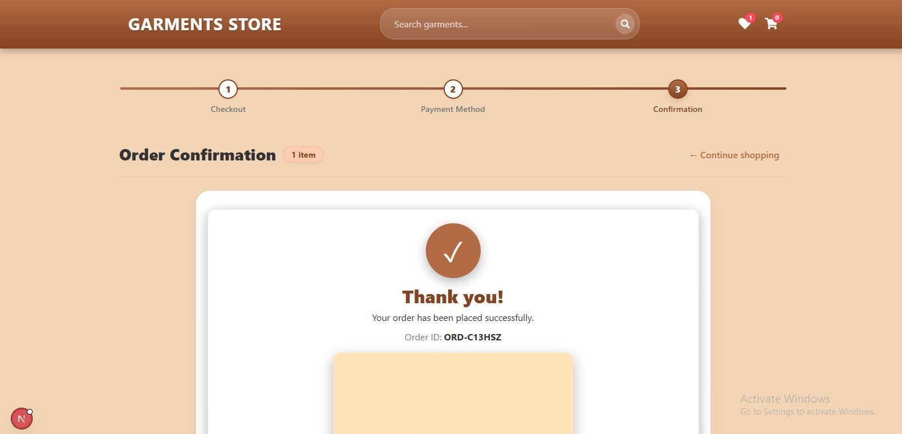
  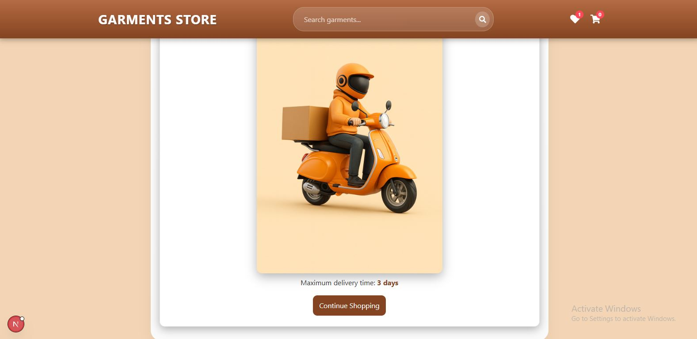
</p>

---

## 🚀 Features

- 🛍️ Browse clothing collections  
- 🔍 View detailed product pages  
- 🛒 Add to cart functionality  
- ➕ Update item quantity  
- 💳 Checkout flow 
- 📱 Fully responsive design  
- ⚡ Fast performance with Next.js  

---

## 🛠️ Tech Stack

- Next.js   
- JavaScript (ES6+)  
- CSS Modules
- Context API

---

## ⚙️ Installation

```bash
git clone https://github.com/Mamoona786/ClothingBrand.git
cd ClothingBrand
npm install
npm run dev
